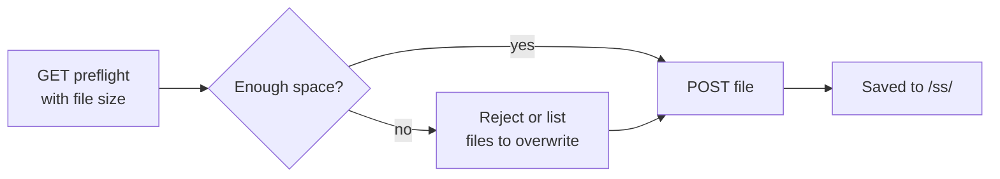

---
sidebar_position: 11
title: Screensaver Upload
---

# Screensaver Upload

Upload a custom screensaver image. The browser converts a PNG / JPG / image into the device s `.ss` format first; this API receives that pre-converted file.

> Most users should use the **Screensaver** page in [NM Monitor](../user-guide/nm-monitor.md) — it handles the conversion automatically. This page is for integrators who want to push their own assets programmatically.

---

## Two-step flow



---

## `GET /api/update/screensaver/preflight`

Ask the device whether a file of `size` bytes can be stored. The device decides whether it has to free space first (by overwriting the oldest existing screensaver).

### Query parameters

| Name   | Required | Meaning                                               |
| ------ | -------- | ----------------------------------------------------- |
| `size` | yes      | Size in bytes of the `.ss` file you intend to upload. |

### Response — file fits

```json
{
  "fileSize":       65536,
  "fsFree":         262144,
  "maxUploadable":  327680,
  "action":         "new",
  "overwriteCount": 0,
  "overwriteFiles": [],
  "existingCount":  2,
  "spaceAfter":     196608
}
```

### Response — needs overwrite

```json
{
  "fileSize":       180000,
  "fsFree":         60000,
  "maxUploadable":  400000,
  "action":         "overwrite",
  "overwriteCount": 2,
  "overwriteFiles": [
    {"name": "saver_320_240_001.ss", "size": 65536},
    {"name": "saver_320_240_002.ss", "size": 72104}
  ],
  "existingCount":  4,
  "spaceAfter":     17640
}
```

### Response — too big

```json
{
  "fileSize":       1500000,
  "fsFree":         60000,
  "maxUploadable":  400000,
  "action":         "reject",
  "overwriteCount": 0,
  "overwriteFiles": [],
  "existingCount":  4,
  "spaceAfter":     0
}
```

| Field              | Type      | Meaning                                                        |
| ------------------ | --------- | -------------------------------------------------------------- |
| `fileSize`         | integer   | Echo of the requested upload size.                             |
| `fsFree`           | integer   | Current free bytes on the on-device FS.                        |
| `maxUploadable`    | integer   | Free bytes **plus** all existing screensaver bytes — the absolute upper bound. |
| `action`           | string    | `"new"`, `"overwrite"`, or `"reject"`.                         |
| `overwriteCount`   | integer   | How many existing screensavers will be deleted to make room.    |
| `overwriteFiles`   | object[]  | The list of files about to be removed (`name` + `size`).        |
| `existingCount`    | integer   | Existing screensaver files matching the current screen size.    |
| `spaceAfter`       | integer   | Predicted free bytes once the upload lands.                     |

---

## `POST /api/update/screensaver`

Uploads the actual `.ss` file as `multipart/form-data`.

### Request

- Content type: `multipart/form-data`
- File extension: **must end in `.ss`**.
- Max size: **200 KB**.
- First 2 bytes of the file: magic `0x4E 0x53`.

### Response — success

```json
{
  "status": "ok",
  "path":   "/ss/saver_320_240_003.ss"
}
```

### Response — failure

| Status | Body                              | Cause                                 |
| ------ | --------------------------------- | ------------------------------------- |
| 400    | `Only .ss files are accepted.`    | Wrong file extension.                 |
| 400    | `Invalid .ss file header.`        | Magic bytes do not match.             |
| 413    | `File too large (max 200 KB).`    | Body exceeded 200 KB.                 |
| 500    | `Failed to open file for writing.`| File system error.                    |
| 500    | `Write error.`                    | File system error during write.       |

### Example

```bash
SIZE=$(stat -c%s saver_320_240_003.ss)
curl "http://192.168.1.42/api/update/screensaver/preflight?size=$SIZE"
# inspect "action"; if "reject", abort
curl -X POST -F "file=@saver_320_240_003.ss" \
     http://192.168.1.42/api/update/screensaver
```

:::warning
Uploading a screensaver briefly **pauses mining** while the file system flushes. Hashrate returns to normal within ~1 second.
:::