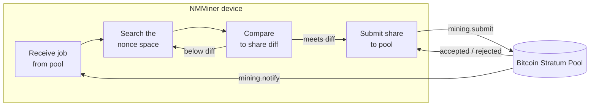

---
sidebar_position: 3
title: NMMiner in the Pipeline
---

# NMMiner in the Pipeline

A black-box view of what happens on the device between "WiFi up" and "share accepted".

## End-to-end picture

## What you, the operator, control

| Knob                         | Effect                                                          |
| ---------------------------- | --------------------------------------------------------------- |
| **Pool URL**                 | Where jobs come from and where shares go.                       |
| **Wallet**                   | Where pool payouts land.                                        |
| **UI refresh rate**          | Higher rate → smoother screen but slightly lower hashrate. Lower rate → max hashrate. |
| **Screen-saver mode**        | `Black` removes display redraw cost → peak hashrate.            |
| **LED enable**               | Cosmetic only.                                                  |
| **WiFi quality**             | A flaky AP causes share-submit failures; rejects rise.          |

## What NMMiner shows you while it works

- **Loading page** — boot, WiFi handshake, first job arrival.
- **Miner page** — live hashrate, share counters, pool diff, pool URL, uptime.
- **Clock / Price / Weather pages** — read-only info pages, do not affect mining.
- **Swarm-aware footer** (on the Miner page) — when the [Swarm](../user-guide/swarm.md) feature is active, the miner also tracks the LAN-wide total hashrate.

## What NMMiner does **not** expose

NMMiner is closed-source firmware. This wiki documents the **inputs**, the **outputs** and the **observable behaviour** of the device. It does not document:

- How the SHA-256d inner loop is implemented (this is NMMiner s core optimisation work).
- The on-chip task layout, memory layout or driver stack.
- Internal storage layout, protocol buffers or stratum parser strategy.

If you want to integrate with the device, do it through the documented [HTTP API](../api/overview.md) — that is the stable, supported contract.