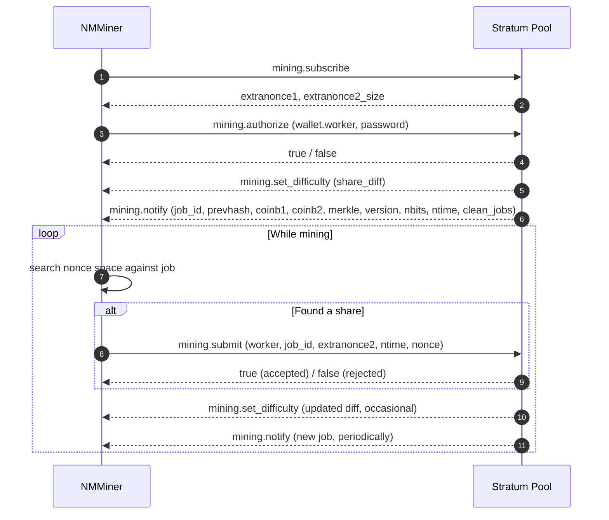

---
sidebar_position: 2
title: Stratum Protocol
---

# Stratum Protocol

**Stratum v1** is the de-facto protocol Bitcoin mining pools use to talk to miners. NMMiner is a Stratum v1 client.

> This page only documents the **public, well-known** Stratum messages every pool understands. Pool-specific extensions and internal implementation details are out of scope.

## Connection

- **Transport**: TCP, or TLS-wrapped TCP for SSL pools.
- **Address scheme**:
  - `stratum+tcp://host:port` — plain TCP.
  - `stratum+ssl://host:port` — TLS.
- **Worker identity**: the wallet address optionally followed by `.workerName`, e.g. `bc1q....workerName`.

The miner keeps the socket open for the entire session. If the pool drops it, NMMiner reconnects automatically.

## Message flow

## What each message means to you

| Message                   | Plain meaning                                                       |
| ------------------------- | ------------------------------------------------------------------- |
| `mining.subscribe`        | "Hi, I want work."                                                  |
| `mining.authorize`        | "I am this wallet."                                                 |
| `mining.set_difficulty`   | Pool sets how easy / hard a share has to be. NMMiner s diff is **tiny**. |
| `mining.notify`           | "Here is a new block template to work on." Old jobs are obsolete.   |
| `mining.submit`           | "Here is a hash that meets the diff."                               |

That is all there is to the protocol from the miner s side.

## What NMMiner shows you on screen / in NM Monitor

| Field            | Comes from                                              |
| ---------------- | ------------------------------------------------------- |
| **Pool**         | The configured URL (host and port).                     |
| **Diff**         | Latest `mining.set_difficulty`.                         |
| **Accepted**     | Count of `true` replies to `mining.submit`.             |
| **Rejected**     | Count of `false` replies to `mining.submit`.            |
| **Session Best** | The highest-difficulty share produced this boot.        |
| **Ever Best**    | The highest-difficulty share produced across all boots. |
| **Hashrate**     | Internal moving average of hashes per second.           |

See also: [Pool List](../reference/pool-list.md) for known-compatible endpoints.