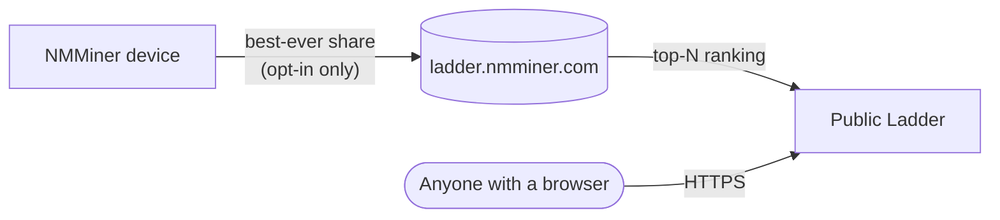

---
sidebar_position: 10
title: Ladder
---

# Ladder — Global Leaderboard

The **Ladder** is NMMiner's global leaderboard. It ranks participating miners by the **highest share difficulty they have ever produced** — your all-time best, not your hashrate, not your share count. One single lucky moment can put a $5 ESP32 above a warehouse of ASICs.

🌐 **Public ladder**: [https://ladder.nmminer.com/](https://ladder.nmminer.com/)

---

## How it works

Every miner that **opts in** periodically reports its best-ever share difficulty to the Ladder backend. The backend aggregates the entries and exposes the top performers at [ladder.nmminer.com](https://ladder.nmminer.com/).

## On-device Ladder page

Every NMMiner with a display has an optional **Ladder** page that mirrors the leaderboard — see the global top-10 right on your miner. Enable it together with the opt-in below.

:::tip Screenless boards (OLED-less / display-less variants)
Boards without a display can still join the Ladder. Just open [NM Monitor](./nm-monitor.md) → **Preferences** and toggle the **Ladder** switch on. Your miner will report normally, even though there is no on-device page to view.
:::

## Opt-in (it's off by default)

The Ladder is **opt-in**. Out of the box NMMiner reports nothing. To join:

1. Open [NM Monitor](./nm-monitor.md) → **Preferences**.
2. Toggle **Ladder** on.
3. Save. The on-device Ladder page becomes active (on boards with a screen) and your miner starts reporting.

You can also flip the setting via the HTTP API — see [`POST /api/setting/preference`](../api/settings-preference.md) (`LadderEnable: true`).

## Privacy

NMMiner takes participant privacy seriously:

- **No personal info** — only the wallet address you mine to is reported, and only the **first 4 + last 4 characters** of that address are ever shown publicly (`bc1q…ab12`).
- **No IP, no hostname** — nothing that could identify you or your network.
- **Off by default** — you have to consciously enable the feature.

## Why join?

- 🏅 **Bragging rights** — see how lucky your tiny ESP32 has been compared to the world.
- 🤝 **Community** — the Ladder is the de-facto meetup for ESP32 BTC enthusiasts.
- ✨ **The thrill** — hitting a high-difficulty share is rare; the Ladder is where those moments get celebrated.

---

> Visit [https://ladder.nmminer.com/](https://ladder.nmminer.com/) to see the current standings.