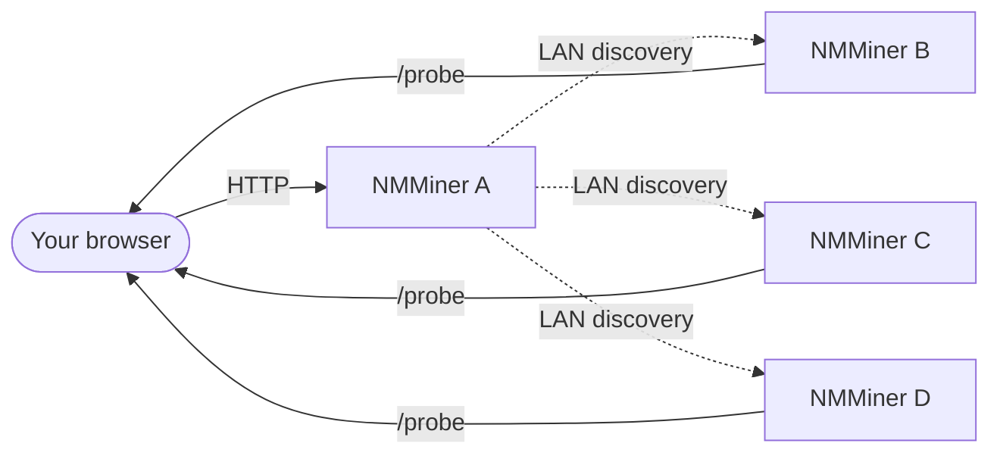

---
sidebar_position: 9
title: Swarm Menu
---

# Swarm Menu

The **Swarm** menu in [NM Monitor](./nm-monitor.md) lets you see and manage **every NMMiner on the same LAN** from a single browser page, with **zero installation**.

A single /24 subnet can host up to **255 devices** discoverable through Swarm — easily enough for a serious home / lab deployment.

## How it works (user view)

1. You open NM Monitor on **any one** miner (or any device that can reach the LAN).
2. The Swarm menu performs a fast LAN sweep.
3. Every reachable NMMiner shows up as a row.
4. NM Monitor sums their hashrates, lists their pools, and lets you ping each one.

The browser does the aggregation — no central server, no cloud, no account.

## What the Swarm table shows

| Column          | Meaning                                                                |
| --------------- | ---------------------------------------------------------------------- |
| **Hostname**    | The miner s hostname (you set this on the Network page).               |
| **IP**          | The miner s LAN IP.                                                    |
| **Version**     | Firmware version reported by the miner.                                |
| **Hashrate**    | Current hashrate in H/s.                                               |
| **Session Best**| Best share difficulty since the miner last booted.                     |
| **Ever Best**   | Best share difficulty across all sessions.                             |
| **Uptime**      | Seconds since boot.                                                    |
| **Find**        | A button that flashes the miner s screen + LED so you can physically locate it. |

A footer row sums up the entire swarm s hashrate so you can see your total LAN hashrate at a glance. While a scan is running, NM Monitor also shows a **progress bar** (added in v2.0.03).

## Common tasks

### Find a specific miner physically

1. Open Swarm.
2. Click the **Find** button on the target row.
3. The selected miner flashes its screen and LED for a few seconds — walk over and grab it.

This is just a single HTTP call ([`POST /api/swarm/find`](../api/swarm-find.md)) — you can also trigger it from your own scripts.

### Compare miners at a glance

Sort the table by **Hashrate**, **Session Best** or **Uptime** to see which board is performing best.

### Re-scan the LAN

The Swarm menu refreshes on its own when you open it. To force an immediate re-scan, leave the menu and come back, or reload the page.

:::tip
Want to roll your own dashboard? Every column in the Swarm table maps directly to a public HTTP endpoint. See [API Reference › Discovery](../api/discovery.md).
:::