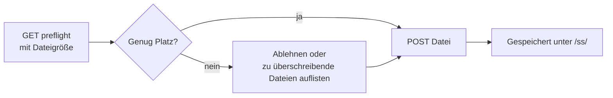

# Bildschirmschoner-Upload

Laden Sie ein benutzerdefiniertes Bildschirmschoner-Bild hoch. Der Browser konvertiert ein PNG/JPG/Bild zuerst in das `.ss`-Format des Geräts; diese API empfängt diese vorkonvertierte Datei.

> Die meisten Benutzer sollten die **Bildschirmschoner**-Seite im [NM Monitor](../user-guide/nm-monitor.md) verwenden — sie übernimmt die Konvertierung automatisch. Diese Seite ist für Integratoren, die eigene Assets programmatisch bereitstellen möchten.

---

## Zwei-Schritt-Ablauf



---

## `GET /api/update/screensaver/preflight`

Fragt das Gerät, ob eine Datei mit `size` Bytes gespeichert werden kann. Das Gerät entscheidet, ob es zuerst Speicherplatz freigeben muss (durch Überschreiben des ältesten vorhandenen Bildschirmschoners).

### Query-Parameter

| Name   | Erforderlich | Bedeutung                                               |
| ------ | ------------ | ------------------------------------------------------- |
| `size` | ja           | Größe in Bytes der `.ss`-Datei, die Sie hochladen möchten. |

### Response — Datei passt

```json
{
  "fileSize":       65536,
  "fsFree":         262144,
  "maxUploadable":  327680,
  "action":         "new",
  "overwriteCount": 0,
  "overwriteFiles": [],
  "existingCount":  2,
  "spaceAfter":     196608
}
```

### Response — benötigt Überschreiben

```json
{
  "fileSize":       180000,
  "fsFree":         60000,
  "maxUploadable":  400000,
  "action":         "overwrite",
  "overwriteCount": 2,
  "overwriteFiles": [
    {"name": "saver_320_240_001.ss", "size": 65536},
    {"name": "saver_320_240_002.ss", "size": 72104}
  ],
  "existingCount":  4,
  "spaceAfter":     17640
}
```

### Response — zu groß

```json
{
  "fileSize":       1500000,
  "fsFree":         60000,
  "maxUploadable":  400000,
  "action":         "reject",
  "overwriteCount": 0,
  "overwriteFiles": [],
  "existingCount":  4,
  "spaceAfter":     0
}
```

| Feld              | Typ       | Bedeutung                                                        |
| ----------------- | --------- | ---------------------------------------------------------------- |
| `fileSize`        | integer   | Echo der angeforderten Upload-Größe.                             |
| `fsFree`          | integer   | Aktuelle freie Bytes im Geräte-Dateisystem.                      |
| `maxUploadable`   | integer   | Freie Bytes **plus** alle vorhandenen Bildschirmschoner-Bytes — die absolute Obergrenze. |
| `action`          | string    | `"new"`, `"overwrite"` oder `"reject"`.                          |
| `overwriteCount`  | integer   | Wie viele vorhandene Bildschirmschoner gelöscht werden, um Platz zu schaffen. |
| `overwriteFiles`  | object[]  | Die Liste der zu entfernenden Dateien (`name` + `size`).          |
| `existingCount`   | integer   | Vorhandene Bildschirmschoner-Dateien, die der aktuellen Bildschirmgröße entsprechen. |
| `spaceAfter`      | integer   | Voraussichtliche freie Bytes nach dem Upload.                     |

---

## `POST /api/update/screensaver`

Lädt die eigentliche `.ss`-Datei als `multipart/form-data` hoch.

### Request

- Inhaltstyp: `multipart/form-data`
- Dateierweiterung: **muss auf `.ss` enden**.
- Maximale Größe: **200 KB**.
- Erste 2 Bytes der Datei: Magic `0x4E 0x53`.

### Response — Erfolg

```json
{
  "status": "ok",
  "path":   "/ss/saver_320_240_003.ss"
}
```

### Response — Fehler

| Status | Body                              | Ursache                              |
| ------ | --------------------------------- | ------------------------------------ |
| 400    | `Only .ss files are accepted.`    | Falsche Dateierweiterung.            |
| 400    | `Invalid .ss file header.`        | Magic-Bytes stimmen nicht überein.   |
| 413    | `File too large (max 200 KB).`    | Body überschreitet 200 KB.           |
| 500    | `Failed to open file for writing.`| Dateisystemfehler.                   |
| 500    | `Write error.`                    | Dateisystemfehler beim Schreiben.    |

### Beispiel

```bash
SIZE=$(stat -c%s saver_320_240_003.ss)
curl "http://192.168.1.42/api/update/screensaver/preflight?size=$SIZE"
# "action" prüfen; bei "reject" abbrechen
curl -X POST -F "file=@saver_320_240_003.ss" \
     http://192.168.1.42/api/update/screensaver
```

:::warning
Das Hochladen eines Bildschirmschoners **pausiert kurz das Mining**, während das Dateisystem flusht. Die Hashrate normalisiert sich innerhalb von ~1 Sekunde.
:::
