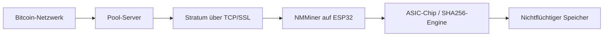

# NMMiner in der Pipeline

Wo NMMiner in die breitere Bitcoin-Mining-Pipeline passt und warum das wichtig ist.

## Die Mining-Pipeline

## Worauf NMMiner sich konzentriert

| Schicht              | Tut NMMiner? | Details                                             |
| -------------------- | ------------ | --------------------------------------------------- |
| Mining-Pool-Betrieb  | ✅ Ja        | Der SoloBTC-Pool ist Teil des NMMiner-Ökosystems     |
| Stratum-Client       | ✅ Ja        | Vollständige Stratum-v1-Implementierung              |
| SHA256-Hashing       | ✅ Ja        | Optimierte ESP32-Assembly (+ Hardware-SHA für einige Chips) |
| Block-Template-Erstellung | ❌ Nein  | Wird vom Pool-Server übernommen                      |
| Transaktionsauswahl  | ❌ Nein      | Wird vom Pool-Server übernommen                      |
| Belohnungsverteilung | ❌ Nein      | Wird vom Pool-Server übernommen (außer solo)         |

## Warum ESP32?

Die ESP32-Familie wird traditionell für IoT verwendet, aber:

- **Dual-Core @ 240 MHz** bietet überraschende Rechenleistung
- **Hardware-SHA-Beschleuniger** auf einigen Chips (S3, C3, C5)
- **Extrem günstig** — $2-5 pro Board
- **Geringer Stromverbrauch** (~2,5W bei Volllast)
- **Riesiges Ökosystem** — einfache Beschaffung, bekannte Tools

Ein Regal mit 20 ESP32-Boards (~20 MH/s) verbraucht weniger Strom als ein einzelner Antminer S19 und kostet weniger als $100 in Hardware.

## Die SoloBTC-Pool-Architektur

NMMiner betreibt seinen eigenen Solo-Mining-Pool unter [solobtc.nmminer.com](https://solobtc.nmminer.com):

- **Solo-Mining-Modell**: Wenn ein NMMiner einen Block findet, erhält er die volle 3,125 BTC-Belohnung.
- **Keine Gebühren**: Der Pool erhebt keine Pool-Gebühren.
- **Globale Infrastruktur**: Server in mehreren Regionen für niedrige Latenz.

## Verwandte Themen

- [Bitcoin Mining Grundlagen](./bitcoin-mining-basics.md)
- [Solo vs. Pool-Mining](./solo-vs-pool-mining.md)
- [Stratum-Protokoll](./stratum-protocol.md)
