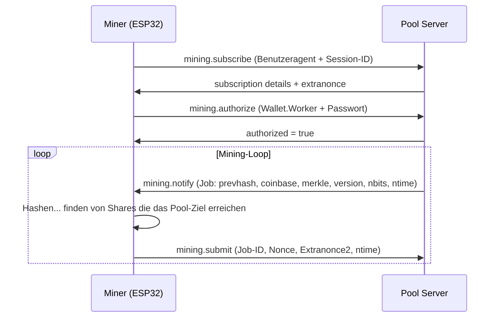

# Stratum-Protokoll

Das Stratum-Protokoll ist die Art und Weise, wie Miner mit Mining-Pools kommunizieren. NMMiner implementiert **Stratum v1** über TCP (und TLS).

## Protokollablauf

## Schlüsselmethoden

### `mining.subscribe`

Der Miner meldet sich an und erhält:
- Eine **Session-ID**
- Einen **Extranonce1**-Wert (vom Pool zur Erweiterung des Nonce-Bereichs)
- Die **Extranonce2-Größe** (wie viele Bytes der Miner selbst anhängen soll)

### `mining.authorize`

Sendet die Anmeldeinformationen des Workers:
- `username` = `wallet_address.worker_name`
- `password` = normalerweise `x` (die meisten Pools ignorieren dies)

### `mining.notify`

Der Pool sendet einen neuen **Job** mit:
- `job_id` — Eindeutiger Bezeichner für diesen Job
- `prevhash` — Hash des vorherigen Blocks
- `coinb1` + `coinb2` — Coinbase-Transaktionsteile
- `merkle_branch` — Merkle-Pfad zur Coinbase
- `version` — Blockversion
- `nbits` — Codiertes Schwierigkeitsziel
- `ntime` — Aktueller Zeitstempel
- `clean_jobs` — Wenn `true`, verwerfen Sie alle vorherigen Jobs

### `mining.submit`

Der Miner reicht eine gefundene Share ein mit:
- `user` — Worker-Name
- `job_id` — Welcher Job bearbeitet wurde
- `extranonce2` — Der vom Miner gewählte Nonce-Teil
- `ntime` — Vom Miner verwendeter Zeitstempel
- `nonce` — Der 32-Bit-Nonce, der die Share ausgelöst hat

## Verbindungsmodi

NMMiner unterstützt zwei Stratum-Transporte:

| Schema           | Port (typisch) | Beschreibung                  |
| ---------------- | -------------- | ----------------------------- |
| `stratum+tcp://` | 3333           | Klartext-Stratum              |
| `stratum+ssl://` | 3333           | TLS-verschlüsseltes Stratum   |

## Diffizile Skalierung

Die Share-Schwierigkeit des Pools bestimmt, wie oft Sie Shares einreichen:

| Pool-Diff | Shares/Minute (bei 1 MH/s) | Netzwerklast |
| --------- | -------------------------- | ------------ |
| 0,001     | ~7/Min                     | Hoch         |
| 0,01      | ~0,7/Min                   | Mittel       |
| 0,1       | ~0,07/Min (alle 14 Min)    | Niedrig      |
| 1,0       | ~0,007/Min (alle 2,4 Std)  | Sehr niedrig |

Die Diffizile wird normalerweise vom Pool automatisch basierend auf Ihrer Hashrate angepasst.

## Referenzen

- [Stratum V1 Spezifikation](https://en.bitcoin.it/wiki/Stratum_mining_protocol) (Bitcoin Wiki)
- [Stratum V2 Entwurf](https://stratumprotocol.org/) — NMMiner unterstützt derzeit kein V2
