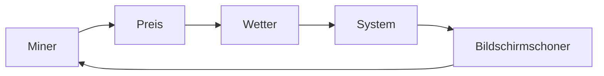

# Tasten & Navigation

So navigieren Sie auf dem Bildschirmmenü des Geräts mit den physischen Tasten.

## Tastenbelegung

Die meisten unterstützten Boards haben mindestens eine Taste. Boards mit Displays haben normalerweise 2-3.

| Taste        | Kurzer Druck                  | Langer Druck (>0,5 s)           |
| ------------ | ----------------------------- | ------------------------------- |
| **BOOT/IO0** | Seite vorwärts/nächste        | Menüaktion (Kontextabhängig)    |
| **IO9**      | Seite rückwärts/vorherige     | Umschalten des Bildschirmschoners|
| **RST**      | Gerät neustarten              | Werkseinstellungen (10 s halten) |

## Seitenablauf

Der Miner-Bildschirm durchläuft diese Seiten der Reihe nach:

| Seite               | Zeigt                                                               |
| ------------------- | ------------------------------------------------------------------- |
| **Miner**           | Hashrate, Shares (akzeptiert/abgelehnt), Pool-URL, beste Share-Diff |
| **Preis**           | BTC/USDT-Preis, K-Line-Diagramm, Watchlist-Rotation                 |
| **Wetter**          | Aktuelles Wetter, Luftqualität, Vorhersage                          |
| **System**          | Firmware-Version, IP-Adresse, Hostname, Betriebszeit, Speicher      |
| **Bildschirmschoner**| Benutzerdefinierte Diashow oder schwarzer Bildschirm               |

## Spezielle Tastenkombinationen

- **Langes Drücken von BOOT auf der Miner-Seite**: Wechselt zwischen primären und sekundären Pool-Einstellungen.
- **Langes Drücken von BOOT auf der Bildschirmschoner-Seite**: Erzwingt das Überspringen des aktuellen Bildschirmschoner-Bildes.
- **RST 10 Sekunden lang gedrückt halten**: Setzt alle Einstellungen auf die Werkseinstellungen zurück (mit Ausnahme der Lizenz).

## Board-spezifische Hinweise

| Board           | Tasten                                                               |
| --------------- | -------------------------------------------------------------------- |
| M5Stack Core    | Drei Fronttasten (A, B, C). C = Menü-Langdruck.                      |
| CYD / CYD2USB   | Eine Taste (BOOT). Für die Navigation kurz drücken, lang für Menü.   |
| ESP32-DevKitC   | BOOT-Taste. Kein Display — Tastendrücke schalten die LED-Modi um.    |
| TTGO T-Display  | Zwei Tasten (IO35 oben, IO0 unten).                                  |
