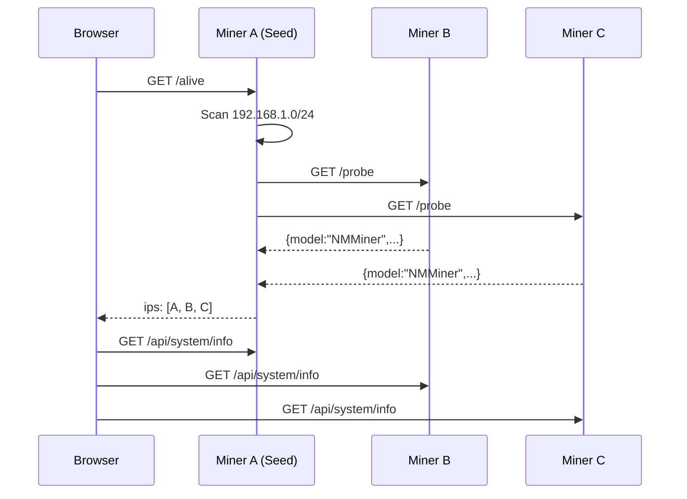

# Swarm

Die Swarm-Funktion erkennt alle NMMiner-Geräte in Ihrem lokalen Netzwerk und bietet aggregierte Steuerung und Überwachung.

## Was ist Swarm?

Swarm ist ein **Peer-Discovery-System** — jeder Miner scannt das lokale /24-Subnetz und pflegt eine Liste anderer NMMiner-Geräte. Kein zentraler Server erforderlich.

## Auf Swarm zugreifen

1. Öffnen Sie `http://<beliebiger-miner-ip>` in Ihrem Browser
2. Klicken Sie auf das **Swarm**-Symbol in der linken Seitenleiste
3. Das Swarm-Panel zeigt alle erkannten Miner an

## Funktionen

### Aggregierte Statistiken
- **Gesamte LAN-Hashrate**: Summe aller Miner
- **Gesamt aktive Miner**: Anzahl mit Hashrate > 0
- **Gesamt akzeptierte Shares**: Netzwerkweit
- **Gesamt abgelehnte Shares**: Netzwerkweit

### Individuelle Miner-Karten
Jeder Miner zeigt:
- Hostname & IP-Adresse
- Aktuelle Hashrate
- Akzeptierte/abgelehnte Shares
- Beste Share-Diff
- Betriebszeit
- Pool-Verbindungsstatus

### Aktionen
| Aktion                 | Beschreibung                                                 |
| ---------------------- | ------------------------------------------------------------ |
| **Miner auswählen**    | Klicken Sie auf einen Miner, um seinen NM Monitor zu öffnen  |
| **Alle neustarten**    | Senden Sie `/api/system/restart` an jeden Miner              |
| **Standortsuche**      | Lassen Sie die LED eines bestimmten Miners blinken (physische Identifikation) |
| **Einstellungen übertragen** | Kopieren Sie Mining-/Netzwerk-Einstellungen auf mehrere Miner |

## Funktionsweise

1. Ihr Browser ruft `/alive` auf einem beliebigen Miner (dem „Seed") auf
2. Dieser Miner gibt jede NMMiner-IP zurück, die er im LAN gefunden hat
3. Der Browser ruft dann `/probe` und `/api/system/info` auf jedem aufgelisteten Miner auf
4. Das Swarm-Panel zeigt alle Ergebnisse in Echtzeit an

:::tip
**Der Seed-Miner muss auf der Miner-Seite sein** (oder das Swarm-Panel geöffnet haben), damit die Discovery aktiv bleibt. Wenn Sie zu einer anderen Seite wechseln, pausiert die Discovery.
:::

## Einstellungen übertragen

So übertragen Sie Mining-Einstellungen auf mehrere Miner:

1. Öffnen Sie das Swarm-Panel
2. Klicken Sie auf **Einstellungen übertragen**
3. Wählen Sie die Zielempfänger-Miner aus
4. Wählen Sie die zu kopierenden Einstellungen (Pool, Netzwerk, Präferenzen)
5. Klicken Sie auf **Übernehmen**

Massenoperationen sind auch über die API verfügbar — siehe [Beispiele](../api/examples.md).

## Einschränkungen

- Funktioniert nur innerhalb eines einzelnen **/24-Subnetzes** (255.255.255.0)
- Die Discovery pausiert, wenn kein Miner auf der Miner-Seite ist
- Geräte müssen Port 80 füreinander erreichbar sein (Standard-LAN-Setup)
- VLANs oder Client-Isolation in Unternehmensnetzwerken verhindern die Discovery
