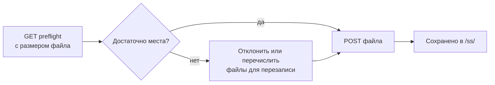

# Загрузка заставки (Screensaver)

Загрузка пользовательского изображения заставки. Браузер сначала преобразует PNG / JPG / изображение в формат `.ss` устройства; это API принимает уже преобразованный файл.

> Большинству пользователей следует использовать страницу **Screensaver** в [NM Monitor](../user-guide/nm-monitor.md) — она выполняет преобразование автоматически. Эта страница предназначена для интеграторов, которые хотят программно отправлять собственные ресурсы.

---

## Двухэтапный процесс



---

## `GET /api/update/screensaver/preflight`

Запрашивает устройство, можно ли сохранить файл размером `size` байт. Устройство определяет, нужно ли сначала освободить место (путём перезаписи самой старой существующей заставки).

### Параметры запроса

| Имя    | Обязательный | Значение                                               |
| ------ | ------------ | ------------------------------------------------------ |
| `size` | да           | Размер в байтах файла `.ss`, который вы собираетесь загрузить. |

### Ответ — файл помещается

```json
{
  "fileSize":       65536,
  "fsFree":         262144,
  "maxUploadable":  327680,
  "action":         "new",
  "overwriteCount": 0,
  "overwriteFiles": [],
  "existingCount":  2,
  "spaceAfter":     196608
}
```

### Ответ — требуется перезапись

```json
{
  "fileSize":       180000,
  "fsFree":         60000,
  "maxUploadable":  400000,
  "action":         "overwrite",
  "overwriteCount": 2,
  "overwriteFiles": [
    {"name": "saver_320_240_001.ss", "size": 65536},
    {"name": "saver_320_240_002.ss", "size": 72104}
  ],
  "existingCount":  4,
  "spaceAfter":     17640
}
```

### Ответ — слишком большой

```json
{
  "fileSize":       1500000,
  "fsFree":         60000,
  "maxUploadable":  400000,
  "action":         "reject",
  "overwriteCount": 0,
  "overwriteFiles": [],
  "existingCount":  4,
  "spaceAfter":     0
}
```

| Поле                | Тип       | Значение                                                        |
| ------------------- | --------- | --------------------------------------------------------------- |
| `fileSize`          | integer   | Эхо запрошенного размера загрузки.                              |
| `fsFree`            | integer   | Текущий объём свободного места на ФС устройства.                |
| `maxUploadable`     | integer   | Свободное место **плюс** все существующие байты заставок — абсолютный верхний предел. |
| `action`            | string    | `"new"`, `"overwrite"` или `"reject"`.                          |
| `overwriteCount`    | integer   | Сколько существующих заставок будет удалено для освобождения места. |
| `overwriteFiles`    | object[]  | Список файлов, которые будут удалены (`name` + `size`).         |
| `existingCount`     | integer   | Существующие файлы заставок, соответствующие текущему размеру экрана. |
| `spaceAfter`        | integer   | Прогнозируемый объём свободного места после завершения загрузки. |

---

## `POST /api/update/screensaver`

Загружает фактический файл `.ss` как `multipart/form-data`.

### Запрос

- Тип содержимого: `multipart/form-data`
- Расширение файла: **должно заканчиваться на `.ss`**.
- Макс. размер: **200 КБ**.
- Первые 2 байта файла: магическая сигнатура `0x4E 0x53`.

### Ответ — успех

```json
{
  "status": "ok",
  "path":   "/ss/saver_320_240_003.ss"
}
```

### Ответ — ошибка

| Статус | Тело                              | Причина                               |
| ------ | --------------------------------- | ------------------------------------- |
| 400    | `Only .ss files are accepted.`    | Неверное расширение файла.            |
| 400    | `Invalid .ss file header.`        | Магические байты не совпадают.        |
| 413    | `File too large (max 200 KB).`    | Тело превысило 200 КБ.                |
| 500    | `Failed to open file for writing.`| Ошибка файловой системы.              |
| 500    | `Write error.`                    | Ошибка файловой системы при записи.   |

### Пример

```bash
SIZE=$(stat -c%s saver_320_240_003.ss)
curl "http://192.168.1.42/api/update/screensaver/preflight?size=$SIZE"
# проверьте "action"; если "reject", прервите
curl -X POST -F "file=@saver_320_240_003.ss" \
     http://192.168.1.42/api/update/screensaver
```

:::warning
Загрузка заставки ненадолго **приостанавливает майнинг** на время сброса файловой системы. Хэшрейт возвращается к норме в течение ~1 секунды.
:::
