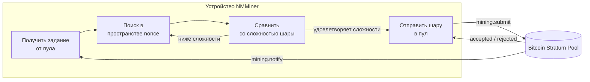

# NMMiner в конвейере

Представление в виде чёрного ящика того, что происходит на устройстве между «WiFi поднят» и «шара принята».

## Сквозная картина

## Что вы, как оператор, контролируете

| Ручка                        | Эффект                                                          |
| ---------------------------- | --------------------------------------------------------------- |
| **URL пула**                 | Откуда приходят задания и куда уходят шары.                    |
| **Кошелёк**                  | Куда поступают выплаты пула.                                   |
| **Частота обновления UI**    | Выше → плавнее экран, но немного ниже хэшрейт. Ниже → макс. хэшрейт. |
| **Режим заставки**           | `Black` устраняет затраты на перерисовку дисплея → пиковый хэшрейт. |
| **LED вкл**                  | Только косметика.                                              |
| **Качество WiFi**            | Нестабильная точка доступа вызывает сбои отправки шар; растут отклонения. |

## Что NMMiner показывает во время работы

- **Страница Loading** — загрузка, рукопожатие WiFi, получение первого задания.
- **Страница Miner** — текущий хэшрейт, счётчики шар, сложность пула, URL пула, время работы.
- **Страницы Clock / Price / Weather** — информационные страницы только для чтения, не влияют на майнинг.
- **Нижний колонтитул Swarm** (на странице Miner) — когда функция [Swarm](../user-guide/swarm.md) активна, майнер также отслеживает общий хэшрейт по всей LAN.

## Что NMMiner **не** раскрывает

NMMiner — это прошивка с закрытым исходным кодом. Эта вики документирует **входы**, **выходы** и **наблюдаемое поведение** устройства. Она не документирует:

- Реализацию внутреннего цикла SHA-256d (это основная оптимизационная работа NMMiner).
- Раскладку задач на чипе, раскладку памяти или стек драйверов.
- Внутреннюю структуру хранения, буферы протокола или стратегию парсера Stratum.

Если вы хотите интегрироваться с устройством, делайте это через документированное [HTTP API](../api/overview.md) — это стабильный, поддерживаемый контракт.
