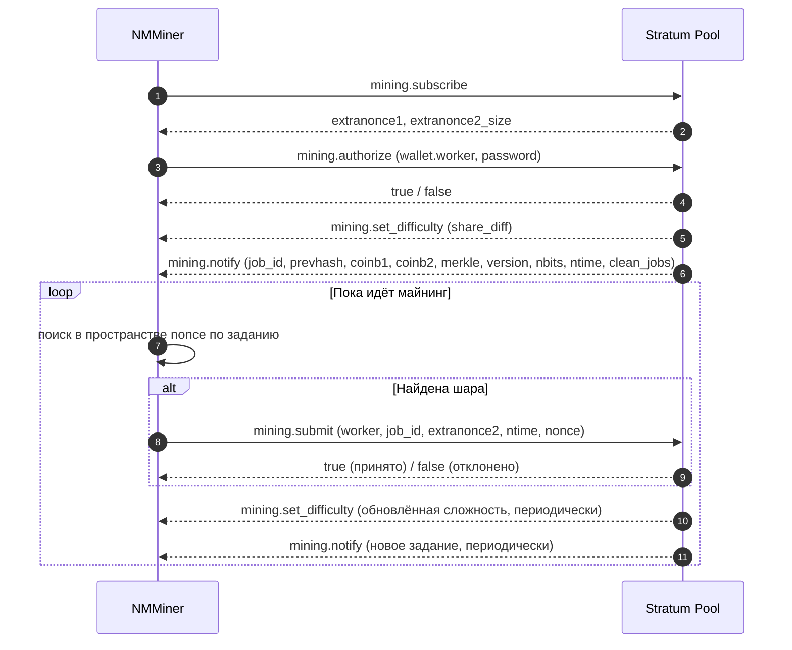

# Протокол Stratum

**Stratum v1** — это де-факто протокол, который пулы майнинга Bitcoin используют для общения с майнерами. NMMiner является клиентом Stratum v1.

> На этой странице документированы только **публичные, общеизвестные** сообщения Stratum, которые понимает каждый пул. Расширения, специфичные для пула, и детали внутренней реализации выходят за рамки.

## Подключение

- **Транспорт**: TCP или TLS-обёрнутый TCP для SSL-пулов.
- **Схема адреса**:
  - `stratum+tcp://host:port` — обычный TCP.
  - `stratum+ssl://host:port` — TLS.
- **Идентификация воркера**: адрес кошелька, опционально с `.workerName`, например `bc1q....workerName`.

Майнер держит сокет открытым в течение всей сессии. Если пул обрывает его, NMMiner переподключается автоматически.

## Поток сообщений

## Что означает каждое сообщение для вас

| Сообщение                  | Простое значение                                                       |
| ------------------------- | --------------------------------------------------------------------- |
| `mining.subscribe`        | «Привет, я хочу работу.»                                              |
| `mining.authorize`        | «Я — этот кошелёк.»                                                   |
| `mining.set_difficulty`   | Пул устанавливает, насколько лёгкой / сложной должна быть шара.       |
| `mining.notify`           | «Вот новый шаблон блока для работы.» Старые задания устарели.         |
| `mining.submit`           | «Вот хеш, который удовлетворяет сложности.»                           |

Это всё, что есть в протоколе со стороны майнера.

## Что NMMiner показывает на экране / в NM Monitor

| Поле            | Источник                                                |
| --------------- | ------------------------------------------------------- |
| **Pool**        | Настроенный URL (хост и порт).                          |
| **Diff**        | Последний `mining.set_difficulty`.                      |
| **Accepted**    | Количество ответов `true` на `mining.submit`.           |
| **Rejected**    | Количество ответов `false` на `mining.submit`.          |
| **Session Best**| Шара с наивысшей сложностью, полученная за эту загрузку. |
| **Ever Best**   | Шара с наивысшей сложностью, полученная за все загрузки. |
| **Hashrate**    | Внутреннее скользящее среднее хешей в секунду.          |

См. также: [Список пулов](../reference/pool-list.md) для известных совместимых конечных точек.
