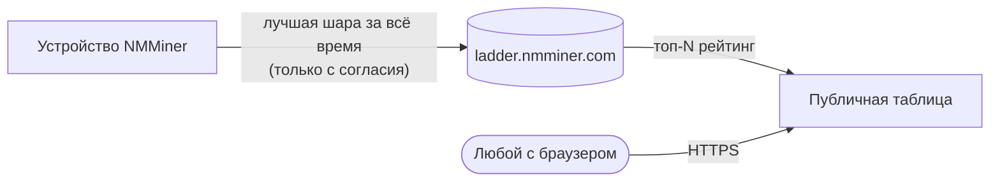

# Ladder — Глобальная таблица лидеров

**Ladder** — это глобальная таблица лидеров NMMiner. Она ранжирует участвующих майнеров по **наивысшей сложности шары, которую они когда-либо получали** — ваш лучший результат за всё время, не хэшрейт, не количество шар. Один-единственный удачный момент может поставить ESP32 за $5 выше склада ASIC-ов.

🌐 **Публичная таблица**: [https://ladder.nmminer.com/](https://ladder.nmminer.com/)

---

## Как это работает

Каждый майнер, который **дал согласие (opt-in)**, периодически сообщает свою лучшую сложность шары за всё время на сервер Ladder. Сервер агрегирует записи и публикует лучших участников на [ladder.nmminer.com](https://ladder.nmminer.com/).

## Страница Ladder на устройстве

Каждый NMMiner с дисплеем имеет опциональную страницу **Ladder**, которая зеркалирует таблицу лидеров — смотрите глобальный топ-10 прямо на своём майнере.

:::tip Платы без экрана (варианты без OLED / без дисплея)
Платы без дисплея всё равно могут присоединиться к Ladder. Просто откройте [NM Monitor](./nm-monitor.md) → **Preferences** и включите переключатель **Ladder**. Ваш майнер будет отправлять данные как обычно, даже если на устройстве нет страницы для просмотра.
:::

## Согласие (opt-in, по умолчанию выключено)

Ladder работает по принципу **opt-in**. Из коробки NMMiner ничего не отправляет. Чтобы присоединиться:

1. Откройте [NM Monitor](./nm-monitor.md) → **Preferences**.
2. Включите переключатель **Ladder**.
3. Сохраните. Страница Ladder на устройстве становится активной (на платах с экраном), и ваш майнер начинает отправлять данные.

Вы также можете изменить настройку через HTTP API — см. [`POST /api/setting/preference`](../api/settings-preference.md) (`LadderEnable: true`).

## Конфиденциальность

NMMiner серьёзно относится к конфиденциальности участников:

- **Никакой личной информации** — сообщается только адрес кошелька, и только **первые 4 + последние 4 символа** когда-либо показываются публично (`bc1q…ab12`).
- **Ни IP, ни имени хоста** — ничего, что могло бы идентифицировать вас или вашу сеть.
- **По умолчанию выключено** — вы должны сознательно включить эту функцию.

## Зачем присоединяться?

- 🏅 **Право похвастаться** — посмотрите, насколько ваш крошечный ESP32 был удачлив по сравнению со всем миром.
- 🤝 **Сообщество** — Ladder является де-факто местом встречи энтузиастов ESP32 BTC.
- ✨ **Острые ощущения** — получение шары высокой сложности — редкость; Ladder — это место, где такие моменты отмечаются.

---

> Посетите [https://ladder.nmminer.com/](https://ladder.nmminer.com/), чтобы увидеть текущие позиции.
