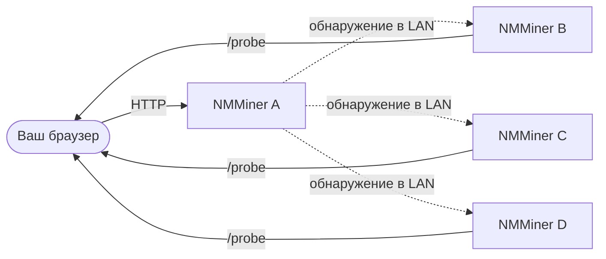

# Меню Swarm

Меню **Swarm** в [NM Monitor](./nm-monitor.md) позволяет видеть и управлять **всеми NMMiner в одной LAN** с одной браузерной страницы, с **нулевой установкой**.

Одна подсеть /24 может вмещать до **255 устройств**, обнаруживаемых через Swarm — более чем достаточно для серьёзного домашнего / лабораторного развёртывания.

## Как это работает (взгляд пользователя)

1. Вы открываете NM Monitor на **любом одном** майнере (или любом устройстве, которое может подключиться к LAN).
2. Меню Swarm выполняет быстрое сканирование LAN.
3. Каждый доступный NMMiner отображается в виде строки.
4. NM Monitor суммирует их хэшрейты, перечисляет их пулы и позволяет вам пинговать каждый из них.

Браузер выполняет агрегацию — никакого центрального сервера, никакого облака, никакой учётной записи.

## Что показывает таблица Swarm

| Столбец          | Значение                                                                |
| ---------------- | ---------------------------------------------------------------------- |
| **Hostname**     | Имя хоста майнера (вы задаёте его на странице Network).                |
| **IP**           | LAN IP майнера.                                                        |
| **Version**      | Версия прошивки, сообщаемая майнером.                                  |
| **Hashrate**     | Текущий хэшрейт в H/s.                                                 |
| **Session Best** | Лучшая сложность шары с момента последней загрузки майнера.            |
| **Ever Best**    | Лучшая сложность шары за все сессии.                                   |
| **Uptime**       | Секунд с момента загрузки.                                             |
| **Find**         | Кнопка, которая заставляет экран майнера + LED мигать, чтобы вы могли физически его найти. |

Строка нижнего колонтитула суммирует хэшрейт всего роя, чтобы вы могли видеть общий хэшрейт LAN с одного взгляда. Пока выполняется сканирование, NM Monitor также показывает **индикатор прогресса** (добавлен в v2.0.03).

## Типичные задачи

### Найти конкретный майнер физически

1. Откройте Swarm.
2. Нажмите кнопку **Find** в строке цели.
3. Выбранный майнер мигает экраном и LED в течение нескольких секунд — подойдите и возьмите его.

Это всего лишь один вызов HTTP ([`POST /api/swarm/find`](../api/swarm-find.md)) — вы также можете запускать его из своих скриптов.

### Сравнить майнеры с одного взгляда

Отсортируйте таблицу по **Hashrate**, **Session Best** или **Uptime**, чтобы увидеть, какая плата работает лучше всего.

### Повторное сканирование LAN

Меню Swarm обновляется самостоятельно при открытии. Чтобы принудительно запустить немедленное повторное сканирование, выйдите из меню и вернитесь или перезагрузите страницу.

:::tip
Хотите создать собственную панель мониторинга? Каждый столбец в таблице Swarm напрямую соответствует публичной конечной точке HTTP. См. [Справочник API › Discovery](../api/discovery.md).
:::
