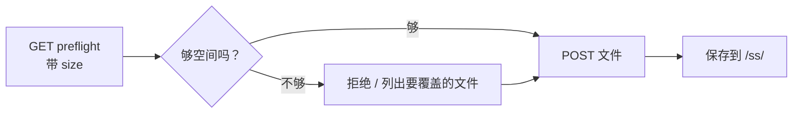

---
sidebar_position: 11
title: 屏保上传
---

# 屏保上传

上传自定义屏保图片。浏览器先把 PNG / JPG 转换成设备私有的 `.ss` 格式，然后这个 API 接收转好的文件。

> 普通用户用 [NM Monitor](../user-guide/nm-monitor.md) 的 **Screensaver** 页 — 自动完成转换。本页给想用脚本推送自己素材的集成方。

---

## 两步流程



---

## `GET /api/update/screensaver/preflight`

向设备查询能否存下 `size` 字节的文件。设备会决定是否需要先删旧屏保腾空间。

### 查询参数

| 名称   | 必填 | 含义                                                |
| ------ | ---- | --------------------------------------------------- |
| `size` | 是   | 要上传的 `.ss` 文件大小（字节）。                   |

### 响应 — 直接能放下

```json
{
  "fileSize":       65536,
  "fsFree":         262144,
  "maxUploadable":  327680,
  "action":         "new",
  "overwriteCount": 0,
  "overwriteFiles": [],
  "existingCount":  2,
  "spaceAfter":     196608
}
```

### 响应 — 需要覆盖旧文件

```json
{
  "fileSize":       180000,
  "fsFree":         60000,
  "maxUploadable":  400000,
  "action":         "overwrite",
  "overwriteCount": 2,
  "overwriteFiles": [
    {"name": "saver_320_240_001.ss", "size": 65536},
    {"name": "saver_320_240_002.ss", "size": 72104}
  ],
  "existingCount":  4,
  "spaceAfter":     17640
}
```

### 响应 — 放不下

```json
{
  "fileSize":       1500000,
  "fsFree":         60000,
  "maxUploadable":  400000,
  "action":         "reject",
  "overwriteCount": 0,
  "overwriteFiles": [],
  "existingCount":  4,
  "spaceAfter":     0
}
```

| 字段               | 类型      | 含义                                                              |
| ------------------ | --------- | ----------------------------------------------------------------- |
| `fileSize`         | integer   | 回显你传的上传大小。                                              |
| `fsFree`           | integer   | 当前设备文件系统剩余字节。                                        |
| `maxUploadable`    | integer   | 剩余 + 所有现存屏保大小 — 绝对上限。                              |
| `action`           | string    | `"new"` / `"overwrite"` / `"reject"`。                            |
| `overwriteCount`   | integer   | 为腾空间会被删掉的现存屏保数。                                    |
| `overwriteFiles`   | object[]  | 将被删除的文件列表（`name` + `size`）。                          |
| `existingCount`    | integer   | 当前屏幕尺寸下已存在的屏保数。                                    |
| `spaceAfter`       | integer   | 上传完成后预计剩余字节。                                          |

---

## `POST /api/update/screensaver`

以 `multipart/form-data` 上传实际的 `.ss` 文件。

### 请求

- Content type: `multipart/form-data`
- 文件扩展名：**必须是 `.ss`**。
- 最大大小：**200 KB**。
- 文件头前 2 字节 magic：`0x4E 0x53`。

### 响应 — 成功

```json
{
  "status": "ok",
  "path":   "/ss/saver_320_240_003.ss"
}
```

### 响应 — 失败

| 状态码 | 体                                | 原因                                  |
| ------ | --------------------------------- | ------------------------------------- |
| 400    | `Only .ss files are accepted.`    | 扩展名错。                            |
| 400    | `Invalid .ss file header.`        | magic 不对。                          |
| 413    | `File too large (max 200 KB).`    | 文件超过 200 KB。                    |
| 500    | `Failed to open file for writing.`| 文件系统错误。                       |
| 500    | `Write error.`                    | 文件系统写入错误。                   |

### 示例

```bash
SIZE=$(stat -c%s saver_320_240_003.ss)
curl "http://192.168.1.42/api/update/screensaver/preflight?size=$SIZE"
# 看 action；如果是 reject 就放弃
curl -X POST -F "file=@saver_320_240_003.ss" \
     http://192.168.1.42/api/update/screensaver
```

:::warning
上传屏保会**短暂暂停挖矿**以便文件系统 flush。Hashrate ~1 秒内恢复正常。
:::