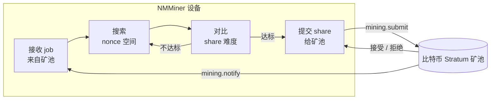

---
sidebar_position: 3
title: NMMiner 在流水线中
---

# NMMiner 在流水线中

从 "WiFi 连上" 到 "share 被接受" 之间，设备内部都做了什么 — 黑盒视角。

## 端到端图

## 操作者能控制的旋钮

| 旋钮                       | 影响                                                              |
| -------------------------- | ----------------------------------------------------------------- |
| **Pool URL**               | 从哪里取 job、把 share 交给谁。                                   |
| **Wallet**                 | 收益打到哪儿。                                                    |
| **UI refresh rate**        | 值高 → 屏幕更流畅但 hashrate 略低；值低 → 最高 hashrate。        |
| **屏保模式**               | `Black` 关掉屏幕刷新开销 → 峰值 hashrate。                       |
| **LED 开关**               | 纯外观。                                                          |
| **WiFi 质量**              | AP 不稳定会导致 share 提交失败、reject 上升。                     |

## 工作时 NMMiner 显示什么

- **Loading 页** — 启动、WiFi 握手、首个 job 到达。
- **Miner 页** — 实时 hashrate、share 计数、矿池 diff、矿池 URL、运行时长。
- **Clock / Price / Weather 页** — 只读信息页，不影响挖矿。
- **Swarm 数据**（Miner 页底部）— 当 [Swarm](../user-guide/swarm.md) 激活时，矿机会跟踪整张局域网的总算力。

## NMMiner **不会** 暴露什么

NMMiner 是闭源固件。本 wiki 文档化的是设备的 **输入**、**输出** 和 **可观察行为**。不会文档化：

- SHA-256d 内层循环怎么实现（这是 NMMiner 核心优化所在）。
- 芯片上的任务排布、内存布局、驱动栈结构。
- 内部存储布局、协议缓冲区、stratum 解析策略。

要做集成？请通过 [HTTP API](../api/overview.md) — 这是稳定的、受支持的契约。