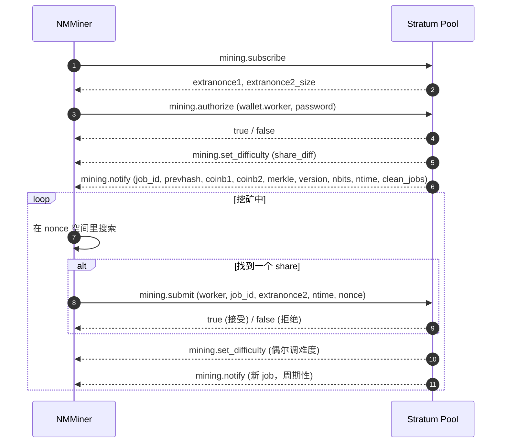

---
sidebar_position: 2
title: Stratum 协议
---

# Stratum 协议

**Stratum v1** 是比特币矿池跟矿工对话的事实标准协议。NMMiner 是 Stratum v1 客户端。

> 本页只描述 **公开、众所周知** 的 Stratum 消息。矿池专有扩展和内部实现细节不在本文档范围内。

## 连接

- **传输层**：TCP，或者 TLS 包裹的 TCP（SSL 矿池）。
- **地址格式**：
  - `stratum+tcp://host:port` — 明文 TCP。
  - `stratum+ssl://host:port` — TLS。
- **Worker 身份**：钱包地址，可加 `.workerName` 后缀，比如 `bc1q....workerName`。

矿机会维持一个长 TCP 会话。掉线后自动重连。

## 消息流

## 每条消息对应啥意思

| 消息                       | 用人话讲                                                        |
| -------------------------- | --------------------------------------------------------------- |
| `mining.subscribe`         | "你好，我要工作。"                                              |
| `mining.authorize`         | "我是这个钱包。"                                                |
| `mining.set_difficulty`    | 矿池告诉你 share 要多难。NMMiner 的 diff **很小**。             |
| `mining.notify`            | "这是新的 block 模板。" 旧 job 立即过期。                      |
| `mining.submit`            | "这是一个达标的 hash。"                                         |

矿工侧整个协议就这些。

## NMMiner 在屏幕 / NM Monitor 上显示什么

| 字段             | 来源                                                       |
| ---------------- | ---------------------------------------------------------- |
| **Pool**         | 配置的 URL（host + port）。                                |
| **Diff**         | 最近一次 `mining.set_difficulty`。                         |
| **Accepted**     | 收到 `mining.submit` → true 的次数。                       |
| **Rejected**     | 收到 `mining.submit` → false 的次数。                      |
| **Session Best** | 本次开机以来产生的最大难度 share。                         |
| **Ever Best**    | 所有开机以来产生的最大难度 share。                         |
| **Hashrate**     | 内部移动平均的每秒 hash 数。                              |

详见：[矿池列表](../reference/pool-list.md)。