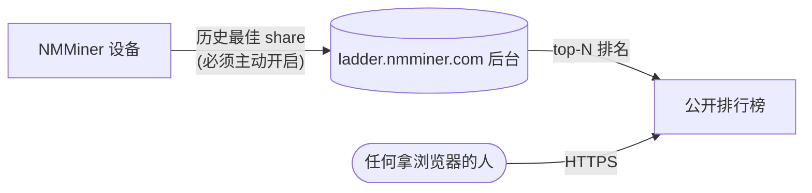

---
sidebar_position: 10
title: 天梯榜
---

# 天梯榜 — 全球排行榜

**天梯榜（Ladder）** 是 NMMiner 的全球排行榜，按 **"历史最佳 share 难度"** 排名 — 不看 hashrate、不看 share 总数，**只看你这辈子最幸运的那一次**。一台 5 美元的 ESP32 完全有可能凭一次好运气压过一整仓库 ASIC。

🌐 **公开榜单**：[https://ladder.nmminer.com/](https://ladder.nmminer.com/)

---

## 怎么运作

每台 **主动开启** 的 NMMiner 会周期性地把自己的历史最佳 share 难度上报到后台。后台聚合数据，把排名靠前的展示在 [ladder.nmminer.com](https://ladder.nmminer.com/)。

## 设备屏幕上的天梯页

每台带屏的 NMMiner 都有一个可选的 **Ladder 页面**，直接在设备上看到全球 top-10 — 跟下面的"开启"一起生效。

:::tip 无屏板（不带 OLED / 不带显示屏的型号）
无屏板照样能加入天梯榜。打开 [NM Monitor](./nm-monitor.md) → **Preferences**，把 **Ladder** 开关打开即可。设备会正常上报数据，只是没有屏幕页可看。
:::

## 开启（默认关闭）

天梯榜是 **主动开启** 的，出厂状态什么都不报。加入步骤：

1. 打开 [NM Monitor](./nm-monitor.md) → **Preferences**。
2. 把 **Ladder** 开关打开。
3. 保存。带屏板上的 Ladder 页激活，设备开始上报数据。

也可以走 HTTP API 切换 — 见 [`POST /api/setting/preference`](../api/settings-preference.md)（`LadderEnable: true`）。

## 隐私

NMMiner 非常重视参与者隐私：

- **不上报个人信息** — 只上报你的钱包地址，且公开页面只显示前 **4 个 + 后 4 个字符**（如 `bc1q…ab12`）。
- **不上报 IP、hostname** — 任何可能识别身份或网络的信息都不上报。
- **默认关闭** — 必须由你主动启用。

## 为什么参与

- 🏅 **吹牛资本** — 看看你这块小 ESP32 跟全世界比谁更幸运。
- 🤝 **社区氛围** — 天梯榜是 ESP32 比特币爱好者事实上的聚集地。
- ✨ **快乐源泉** — 打中高难度 share 本来就稀有，天梯榜是这些时刻被庆祝的地方。

---

> 现在就去 [https://ladder.nmminer.com/](https://ladder.nmminer.com/) 看看当前排名。