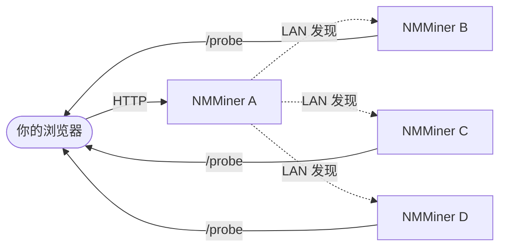

---
sidebar_position: 9
title: Swarm 菜单
---

# Swarm 菜单

[NM Monitor](./nm-monitor.md) 里的 **Swarm** 菜单让你在一个浏览器页面里看到并管理 **整张局域网内所有 NMMiner**，**完全零安装**。

单个 /24 子网最多支持 **255 台** 矿机被 Swarm 发现 — 满足一般家用 / 实验室规模。

## 工作原理（用户视角）

1. 在 **任意一台** 矿机（或局域网内任何能访问的设备）上打开 NM Monitor。
2. Swarm 菜单做一次快速 LAN 扫描。
3. 每台可达的 NMMiner 出现一行。
4. NM Monitor 汇总所有机器的算力、列出矿池、可对任意一台 ping 定位。

聚合由浏览器自己完成 — 没有中心服务器、没有云、不需要账号。

## Swarm 表格的列

| 列              | 含义                                                                  |
| --------------- | --------------------------------------------------------------------- |
| **Hostname**    | 矿机的 hostname（在 Network 页设置）。                                |
| **IP**          | 矿机的局域网 IP。                                                    |
| **Version**     | 矿机上报的固件版本。                                                  |
| **Hashrate**    | 当前 hashrate (H/s)。                                                 |
| **Session Best**| 本次开机以来最佳 share 难度。                                         |
| **Ever Best**   | 所有开机记录中的最佳 share 难度。                                     |
| **Uptime**      | 自上次开机以来的秒数。                                                |
| **Find**        | 闪屏 + 闪灯定位指定矿机的按钮 — 方便物理找机器。                     |

表格底部还会显示**全局总算力**，一眼看出全部矿机加起来多少 KH/s。扫描进行中时还会显示**进度条**（v2.0.03 起）。

## 常见任务

### 物理定位某台矿机

1. 打开 Swarm。
2. 点目标行的 **Find** 按钮。
3. 那台矿机会闪几秒屏 + LED，过去拿它就行。

底层是一个 HTTP 调用 ([`POST /api/swarm/find`](../api/swarm-find.md)) — 你也可以从脚本里触发。

### 快速对比矿机

按 **Hashrate**、**Session Best** 或 **Uptime** 排序，看哪台板子工作得最好。

### 重新扫描局域网

进入 Swarm 菜单会自动刷新。强制立即重扫：离开菜单再回来，或刷新页面。

:::tip
想做自定义 dashboard？Swarm 表的每一列都直接对应一个公开 HTTP 端点。见 [API 参考 › 发现接口](../api/discovery.md)。
:::